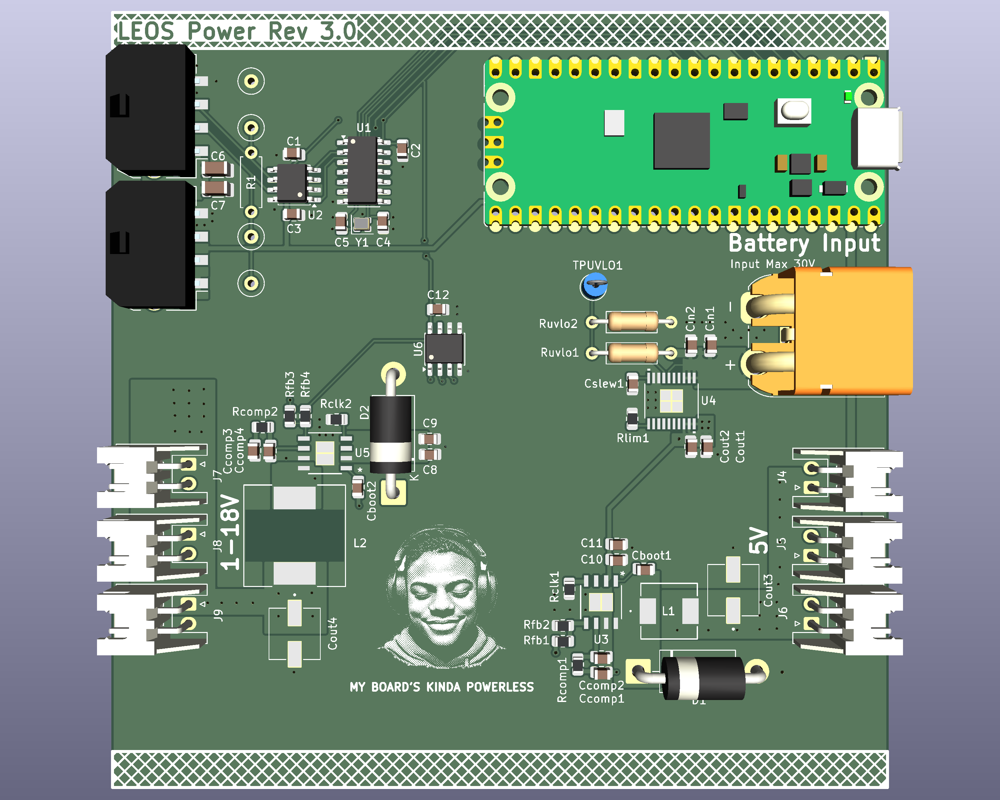

# LEOS F26 Power PCB

This repository contains the KiCad design files for the LEOS power board made fall 2026. The board is designed to accept power from a 6S LiPo battery, provide input protection, and generate adjustable DC output for other LEOS components. This board also includes the base elements from the template board.

The design uses a Texas Instruments TPS16630 eFuse for input protection and two TPS54540B buck converters for voltage regulation. A Raspberry Pi Pico controls the output voltage through the MCP41100 SPI digital potentiometer in one of the buck converter's feedback network. 

The target output ranges are 5V at up to 5A and 1-18V at up to 5A. 

# Board Overview
The power board has three main functions:
Input protection: A TPS16630 eFuse provides adjustable undervoltage lockout, overvoltage protection, current limiting, and controlled startup.
DC-DC conversion: Two TPS54540B switching buck converters step down the battery voltage to both a fixed and adjustable output voltage.
Digital control: A Raspberry Pi Pico communicates with an MCP41100 digital potentiometer over SPI to adjust one of the buck converters' feedback resistance.

# Electrical design targets
Input source: 6S LiPo battery
Nominal input voltage: 22.2V
Fully charged battery voltage: 25.2V
Input undervoltage cutoff: Approximately 19-19.5V
Output voltage: 5V and approximately 1-18V adjustable 
Maximum output current: 5A
Buck converter: TPS54540B
eFuse: TPS16630
Digital potentiometer: MCP41100T-I/SN
Control interface: SPI from Raspberry Pi Pico

